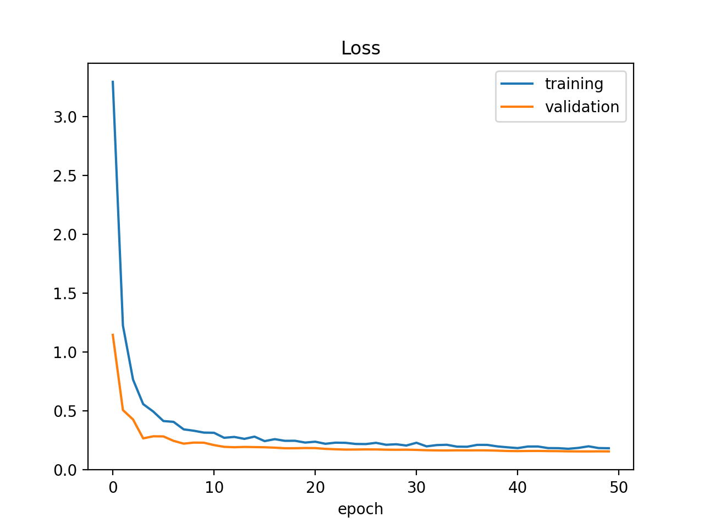

# DenseNet Classification Model

A deep learning classification model using DenseNet architecture to classify images into four intensity categories: Moderate, Negative, Strong, and Weak.

## Overview

This project implements a DenseNet-based classifier for image classification tasks. The model is trained to categorize images into four distinct classes based on intensity levels.

## Classes

1. Moderate - Medium intensity features
2. Negative - Absence of target features
3. Strong - High intensity features
4. Weak - Low intensity features

## Requirements

```
torch>=1.8.0
torchvision>=0.9.0
numpy>=1.19.2
pillow>=8.0.0
matplotlib>=3.3.0
```

## Quick Start

1. Install dependencies:
```bash
pip install -r requirements.txt
```

2. Run training:
```bash
python train.py --data_dir /path/to/dataset
```

3. Make predictions:
```bash
python classify.py --image_path /path/to/image
```

## Dataset Structure

```
data/
├── train/
│   ├── moderate/
│   ├── negative/
│   ├── strong/
│   └── weak/
└── valid/
    ├── moderate/
    ├── negative/
    ├── strong/
    └── weak/
```

## Model Architecture

- Base: DenseNet
- Input size: 224x224x3
- Output: 4 classes
- Pretrained: ImageNet weights

## Performance

- Training losses: 
- confusion matrix: 

## Contact

For questions or issues, please open a GitHub issue 


